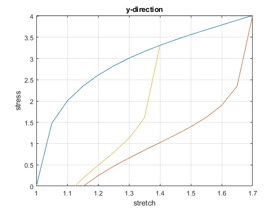

# NetworkEvo
Implementation of simulating and visualizing the stress-strain relationship (via the First Piola stress tensor) for a material undergoing stretching and unloading. 

## Overview

This simulation models the cyclic loading behavior of a material using a network evolution theory, with a focus on simulating stress softening, permanent set, and induced anisotropy in response to repeated loading and unloading cycles. The model is implemented using MATLAB and leverages a material's stress-strain relationship during cyclic deformation.

The material's response is calculated through a series of loading and unloading steps, simulating real-world behavior under repeated mechanical stress, with particular attention paid to the development of permanent deformation (permanent set) after each unloading phase.

## Simulation Milestones
1. Initial Loading: The material is first stretched from its undeformed state (stretch = 1) to the final stretch (based on experimental data). The stress at each increment is calculated using an empirical function, which determines the material’s stress based on the current stretch.
2. Unloading Phase: After reaching the final stretch, the material undergoes unloading to a lower stretch value. This phase simulates the material’s response when the applied stress is removed.
3. Permanent Set: Following each unloading phase, the stretch at which unloading begins is reduced slightly (by an empirical percentage) to simulate permanent deformation. This reduction causes the unloading curve to shift downward for subsequent cycles.
4. Multiple Loading-Unloading Cycles: The process of loading and unloading is repeated for a specified number of cycles. Each cycle starts from the last unloading point, and the unloading limit is adjusted to simulate continued damage and permanent deformation.
5. Hysteresis and Stress Softening: As the simulation progresses, the material experiences stress softening (reduced stiffness) and a shifting unloading curve due to the accumulation of permanent set. This results in the formation of a hysteresis loop, illustrating the material's response to cyclic loading.
6. Final Results: After completing all cycles, the simulation plots the material's stress-strain behavior over time. The loading and unloading paths for each cycle are visualized, showing the overall effects of cyclic loading, including the material's softened response and permanent deformation.

## Result
